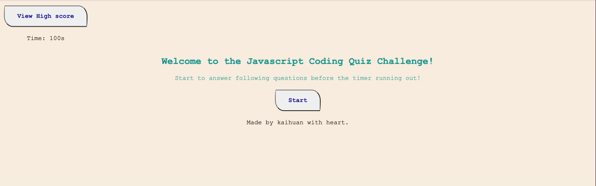

# Quiz_App-JavaScript-

## Description

A time coding quiz with multiple-choice questions; feature dynamically updated HTML and CSS powered by JavaScript with a clean, polished, and responsive user interface.

Deployed app: https://kaihuan-huang.github.io/Quiz_App-JavaScript-/

Gitpage: https://kaihuan-huang.github.io/Quiz_App-JavaScript-/

- Using JavaScript fundamentals to store high scores;

- Clicking the start button to start the coding quiz;

- Presenting another question when you answered;

- When all the questions are answered or the timer reaches 0, time is subtracted from the clock;

- Saving your initials and scores when the game is over;

Mock-up

## Screenshots

The following images demonstrate the web application's appearance:

;
;
.
---
